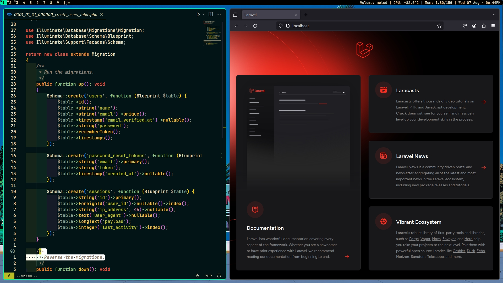
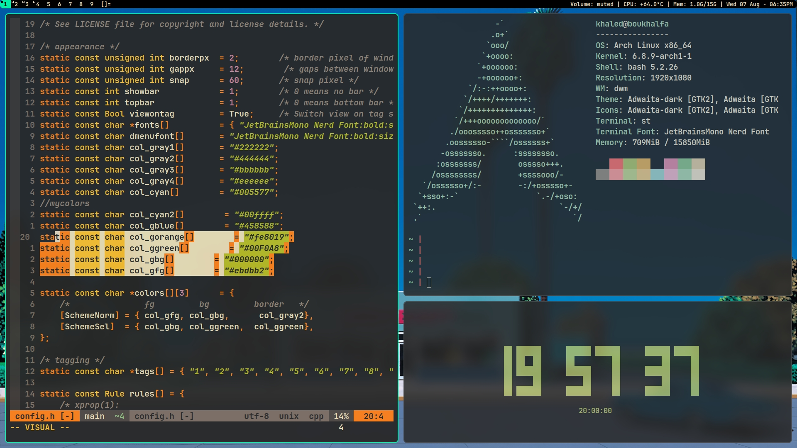
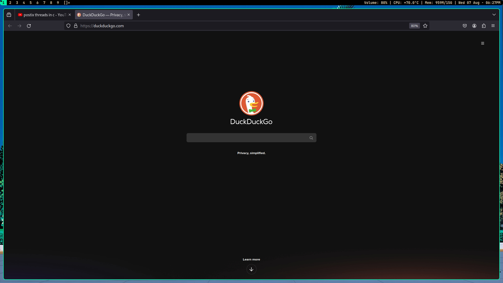
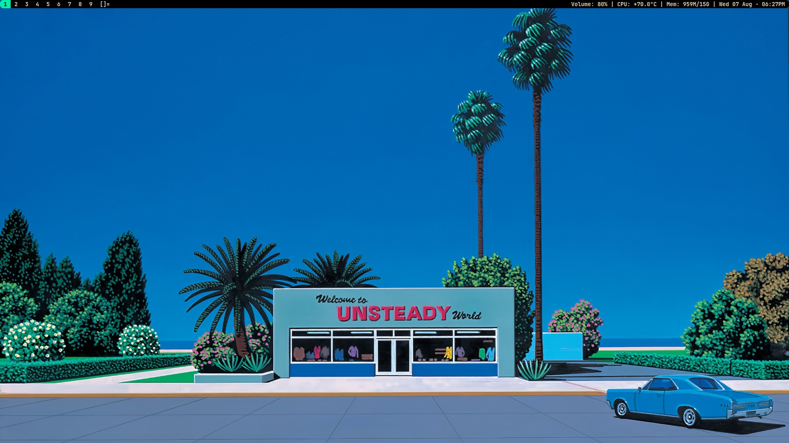
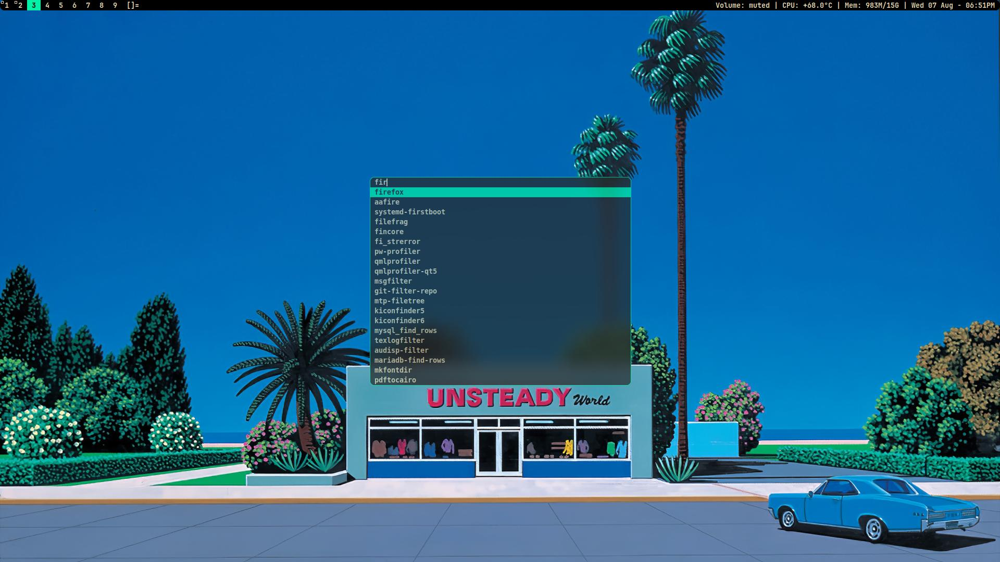

dwm - dynamic window manager
============================
dwm is an extremely fast, small, and dynamic window manager for X.
my version after applying some patches
[dwm](https://dwm.suckless.org/)

- noborder [ removed ]
- push_no_master
- uselessgap 
- centeredmaster
- notitle
- pertag
- viewontag
- tiledmove
- resizehere
- dwm-khaled.diff  [just my config]

